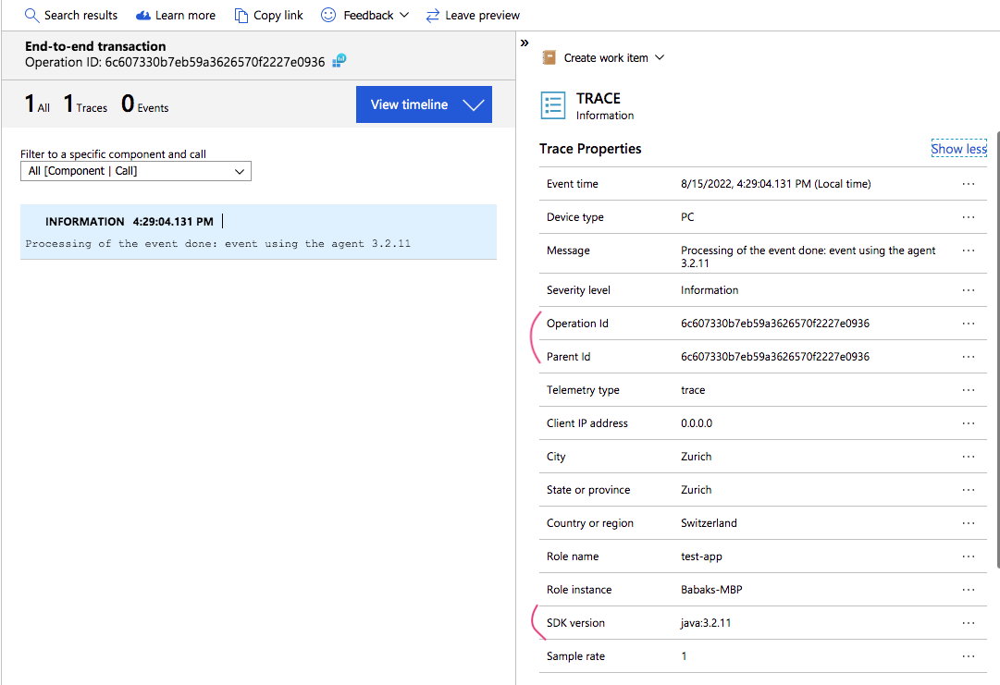
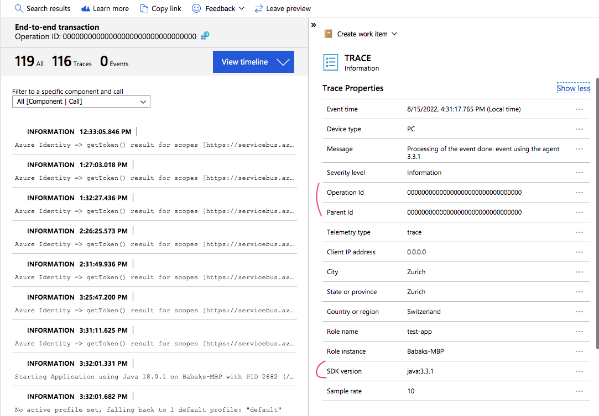

# Build

First specify your own Azure ServiceBus coordinations [here](src/main/resources/application.yml)

And then build the Ueber JAR:

```
mvn package
```

# Run

Now run using the Agent version `3.2.11`:

```
java -javaagent:agent/applicationinsights-agent-3.2.11.jar -jar target/test-app-1.0.0-SNAPSHOT.jar
```



And then using the Agent version `3.3.1`:

```
java -javaagent:agent/applicationinsights-agent-3.2.11.jar -jar target/test-app-1.0.0-SNAPSHOT.jar
```


